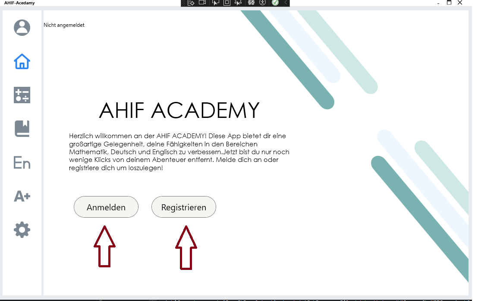
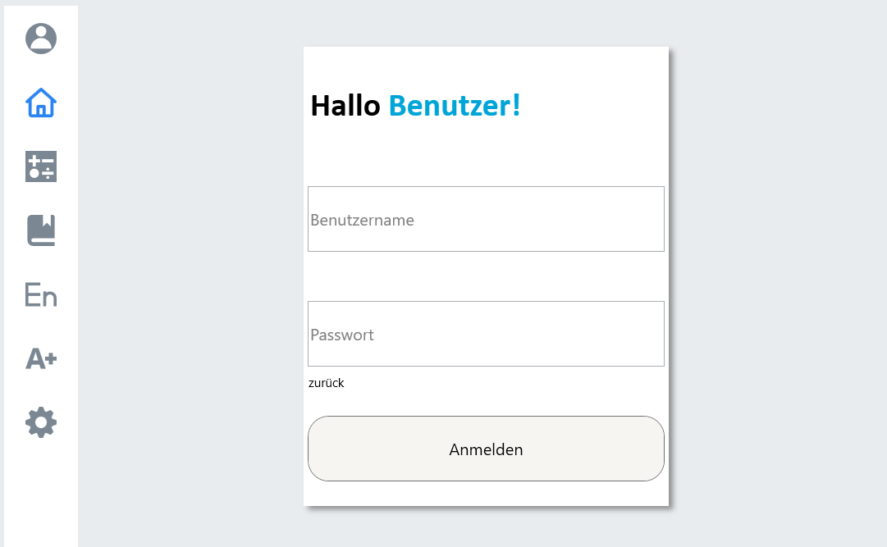
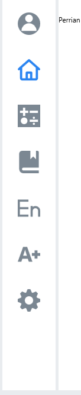
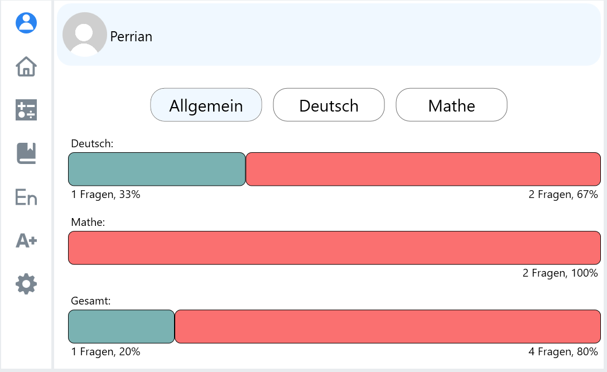
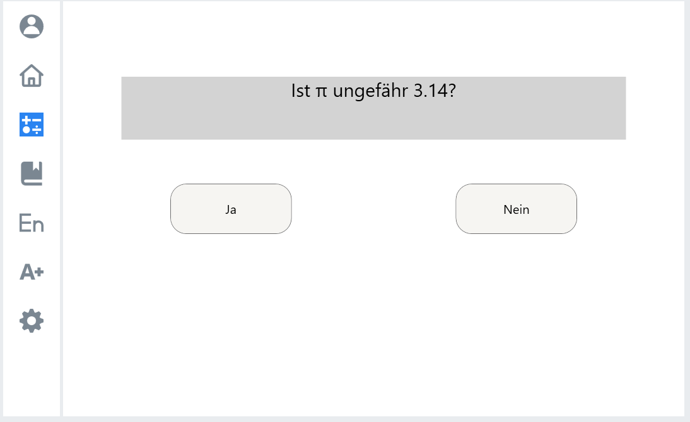
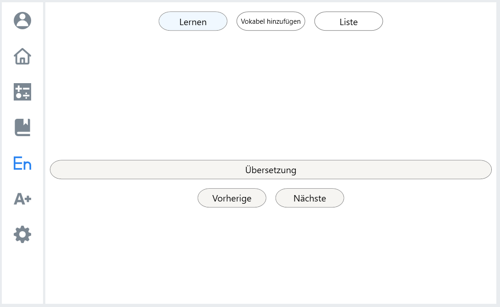
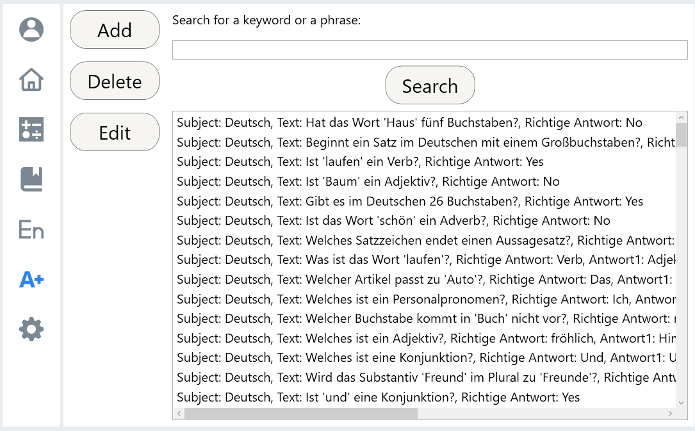
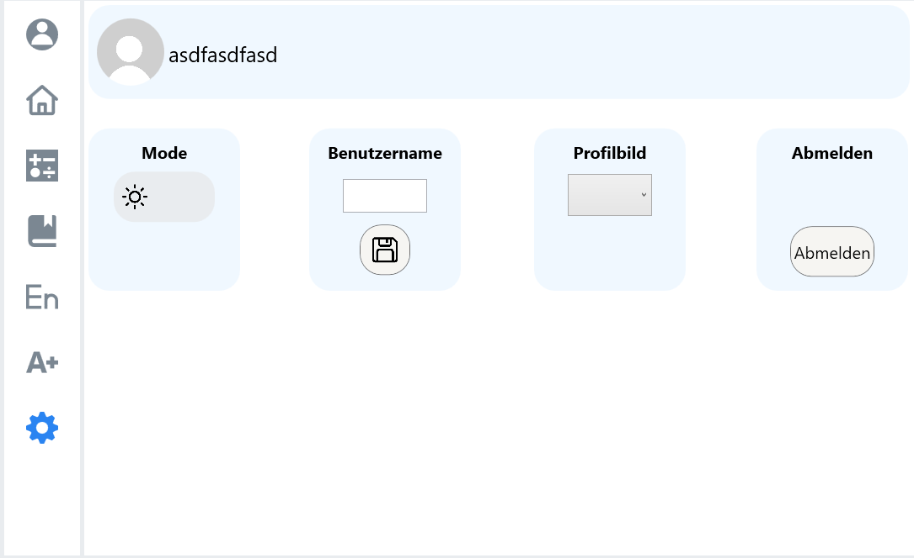

# Bedienungsanleitung

Ansicht nach dem Start des Programms:  
  
Mit den auf dem Screenshots markierten Buttons kann man sich entweder anmelden oder sich registrieren. Erst wenn dieser Schritt getätigt wird, kann angefangen werden.  

  
Nach dem Klick auf einen der oben erwähnten Buttons, kommt man auf diese Page. Auf dieser kann man sich nun entweder (je nachdem, welche Button geklickt wurde) mit schon vorhandenen Daten anmelden oder registrieren. Nach dem Eingeben der Daten kann man mit "Anmelden" / "Registrieren" wieder auf die HomePage zurückkehren.  

  
Mit den Icons an der Seite kommt man dann zu den jeweiligen Pages. Wenn man über die Symbole hovert, sieht man wohin es einen führt.  

  
Wenn man auf das "Profil" geht, sieht man seine persönlichen Statistiken. Je nahcdem, welcher Button geklickt wird, sieht man andere Statistiken.  

  
Beim Klick auf das "Mathe"-Icon kommt man auf eine Page, auf welcher man Mathe fragen beantworten kann. Nach dem Beantworten jeder Frage wird in der oberen rechten Ecke ein Button  "Nächste Frage" angezeigt. 
Dasselbe gilt für das "Deutsch"-Icon unter dem "Mathe"-Icon  

  
Beim Klick auf das "Englisch"-Icon kommt man auf eine Page, auf welcher man Vokabeln üben kann. Beim Klick auf "Vokabel hinzufügen" kann man neue Vokabeln hinzufügen und mit "Liste" sieht man eine Liste der Vokabeln.  

  
Beim Klick auf das "Fragenliste"-Icon kommt man auf eine Page, auf welcher alle Fragen angezeigt werden. Man kann nun Fragen hinzufügen, editieren und löschen. Bevor man auf "Editieren" und "Löschen" klicken kann, muss man eine Frage aus der Liste anklicken.  

  
Beim Klick auf das "Zahnrad"-Icon kann man sein Profil bearbeiten. Man kann das Theme zum Darkmode oder Lightmode wechseln, seinen Benutzernamen wechseln, sein Profilbild wechseln oder sich abmelden.  

